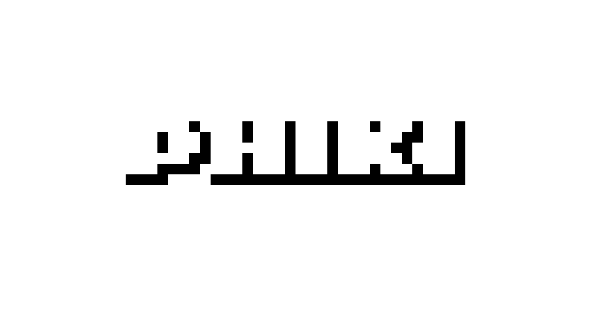
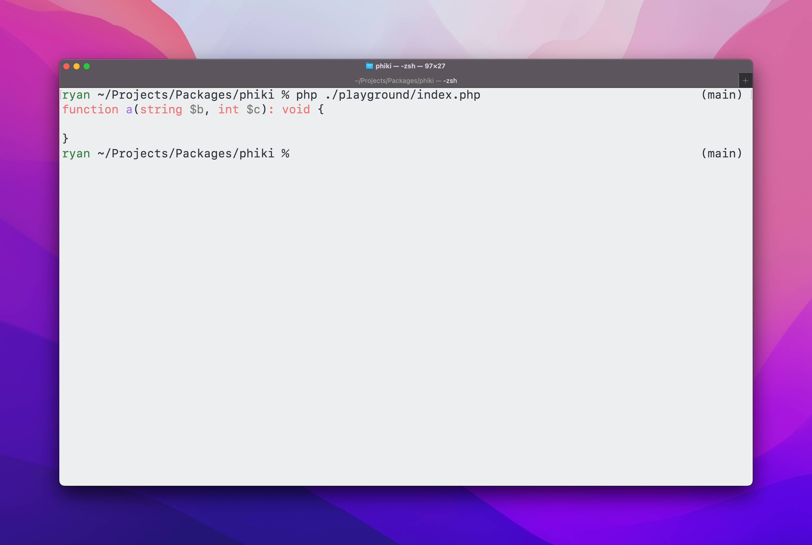

Phiki is a syntax highlighter written in PHP. It uses TextMate grammar files and Visual Studio Code themes to generate syntax highlighted code for the web and terminal.

The name and public API of Phiki is heavily inspired by [Shiki](https://shiki.style/), a package that does more or less the same thing in the JavaScript ecosystem. The actual implementation of the highlighter is inspired by the [`vscode-textmate`](https://github.com/microsoft/vscode-textmate) package which Shiki uses internally, but isn't a 1-1 translation since the internal APIs of Phiki differ to `vscode-textmate`.

## Installation

Install Phiki via Composer:

```sh
composer require phiki/phiki
```

## Getting Started

The fastest way to get started is with the `codeToHtml()` method.

```php
use Phiki\Phiki;
use Phiki\Grammar\Grammar;
use Phiki\Theme\Theme;

$phiki = new Phiki();

$html = $phiki->codeToHtml(
    <<<'PHP'
    echo "Hello, world!";
    PHP,
    Grammar::Php,
    Theme::GithubDark,
);
```

This method takes in the code you want to highlight, the target language, as well as the theme you want to use. It then returns the generated HTML as a string. 

> [!NOTE]
> All of Phiki's styling is applied using inline `style` attributes, so there's no need to add any CSS to your project.

### Supported Languages

Phiki ships with 200+ grammars and 50+ themes. To provide a clean developer experience, you can find all supported grammars and themes when using the `Phiki\Grammar\Grammar` and `Phiki\Theme\Theme` enums.

These files are auto-generated when pulling in grammar and theme files from remote repositories so are always up-to-date.

### CommonMark Integration

Phiki provides a convenient extension for the excellent `league/commonmark` package so that you can start using it on your blog or documentation site with very little effort.

All you need to do is register the extension through a CommonMark `Environment` object.

```php
use League\CommonMark\Environment\Environment;
use League\CommonMark\Extension\CommonMark\CommonMarkCoreExtension;
use League\CommonMark\MarkdownConverter;
use Phiki\CommonMark\PhikiExtension;

$environment = new Environment;
$environment
    ->addExtension(new CommonMarkCoreExtension)
    ->addExtension(new PhikiExtension('github-dark'));

$converter = new MarkdownConverter($environment);
$output = $converter->convert(<<<'MD'
    ```html
    <p>Hello, world!</p>
    ```
    MD);
```

Phiki also allows you to wrap the generated `<pre>` element in an additional `<div>`. This is especially useful when trying to avoid issues with the CSS `overflow` property, as you can position things relative to the wrapping element instead of the code block itself.

```php
$environment
    ->addExtension(new CommonMarkCoreExtension)
    ->addExtension(new PhikiExtension('github-dark', withWrapper: true));
```

### Laravel

If you're using Laravel's `Str::markdown()` or `str()->markdown()` methods, you can use the same CommonMark extension by passing it through to the method.

```php
use Phiki\CommonMark\PhikiExtension;

Str::markdown('...', extensions: [
    new PhikiExtension('github-dark'),
]); 
```

### Using custom languages and themes

To use a language or theme that Phiki doesn't support, you need to register it with a `GrammarRepository` or `ThemeRepository`.

This can be done by building a custom `Environment` object and telling Phiki to use this instead of the default one.

```php
use Phiki\Environment\Environment;

$environment = Environment::default();

// Register a custom language.
$environment
    ->getGrammarRepository()
    ->register('my-language', __DIR__ . '/../path/to/grammar.json');

$environment
    ->getThemeRepository()
    ->register('my-theme', __DIR__ . '/../path/to/theme.json');

$phiki = new Phiki($environment);

$phiki->codeToHtml('...', 'my-language', 'my-theme');
```

### Terminal Output

Phiki has support for generating output designed for use in the terminal. This is available through the `codeToTerminal()` method which accepts the same parameters as the `codeToHtml()` method.

```php
echo $phiki->codeToTerminal('echo "Hello, world"!', Grammar::Php, Theme::GithubDark);
```



### Binary

If you want to use Phiki to highlight a file in the terminal without writing any PHP code, you can use the `phiki` binary.

```sh
vendor/bin/phiki ./path/to/file --grammar php --theme github-dark
```

This will output the highlighted code from that file using the grammar and theme provided.

### Line numbers

Each line has its own `<span>` element with a `data-line` attribute, so you can use CSS to display line numbers in the generated HTML. The benefit to this approach is that the text isn't selectable so you code snippets can be highlighted the same as before.

```css
pre code span[data-line]::before {
    content: attr(data-line);
    display: inline-block;
    width: 1.7rem;
    margin-right: 1rem;
    color: #666;
    text-align: right;
}
```

These styles are of course just a guide. You can change the colors and sizing to your own taste.

### Multi-theme support

Phiki has support for highlighting code with multiple themes. This is great for sites that have a color scheme switcher, allowing you to change the theme used in each mode.

To take advantage of this, pass an array of themes to the `codeToHtml()` method.

```php
$phiki->codeToHtml("...", Grammar::Php, [
    'light' => Theme::GithubLight,
    'dark' => Theme::GithubDark,
]);
```

The first entry in the array will be used as the default theme. Other themes in the array will add additional CSS variables to the `style` attribute on each token, as well as the surrounding `<pre>` element. This means you'll need to use some CSS on your site to switch between the different themes.

**Query-based dark mode**

```css
@media (prefers-color-scheme: dark) {
    .phiki,
    .phiki span {
        color: var(--phiki-dark-color) !important;
        background-color: var(--phiki-dark-background-color) !important;
        font-style: var(--phiki-dark-font-style) !important;
        font-weight: var(--phiki-dark-font-weight) !important;
        text-decoration: var(--phiki-dark-text-decoration) !important;
    }
}
```

**Class-based dark mode**

```css
html.dark .phiki,
html.dark .phiki span {
    color: var(--phiki-dark-color) !important;
    background-color: var(--phiki-dark-background-color) !important;
    font-style: var(--phiki-dark-font-style) !important;
    font-weight: var(--phiki-dark-font-weight) !important;
    text-decoration: var(--phiki-dark-text-decoration) !important;
}
```

Phiki doesn't limit you to light and dark mode themes – you can use any key you wish in the array and CSS variables will be generated accordingly. You can then adjust the CSS on your site to apply those styles accordingly.

#### Usage with CommonMark extension

Multiple themes can also be used with the [CommonMark extension](#commonmark-integration) by passing an array to the extension object.

```php
$environment
    ->addExtension(new CommonMarkCoreExtension)
    ->addExtension(new PhikiExtension([
        'light' => Theme::GithubLight,
        'dark' => Theme::GithubDark,
    ]));
```

## Known Limitations & Implementation Notes

The implementation of this package is inspired by existing art, namely `vscode-textmate`. The main reason that implementing a TextMate-based syntax highlighter in PHP is a complex task is down to the fact that `vscode-textmate` (and the TextMate editor) uses the [Oniguruma](https://github.com/kkos/oniguruma) engine for handling regular expressions.

PHP uses the PCRE2 engine which doesn't have support for all of Oniguruma's features. To reduce the risk of broken RegExs, Phiki performs a series of transformations with solid success rates:

* Properly escape unescaped forward-slashes (`/`).
* Translate `\h` and `\H` to PCRE equivalents.
* Translate `\p{xx}` to PCRE-compatible versions.
* Escape invalid leading range characters (`[-...]`).
* Properly escape unescaped close-set characters (`]`).
* Translate unsupported Unicode escape sequences (`\uXXXX`).

One of the biggest differences between PCRE2 and Oniguruma is that Oniguruma has support for "variable-length lookbehinds". Variable-length lookbehinds, both positive and negative, are normally created when a quantifier such as `+` or `*` is used inside of the lookbehind.

PCRE2 **does not** support these types of infinite-length lookbehinds and they're impossible to translate into PCRE2-compatible equivalents. If you're using PHP 8.4 however, you can get very close since Phiki performs a series of patches on grammar files to translate `*` into a `{0,254}` and `+` into a `{1,255}`.

**These patches are not identical or perfect** – there is still a chance of running into errors in your application when highlighting code! If you do encounter an error with a message like the one below, please check the [Issues](https://github.com/phikiphp/phiki/issues) page or create a new issue with information about the grammar / language you're highlighting and a reproduction case.

```
preg_match(): Compilation failed: length of lookbehind assertion is not limited at offset...
```

> [!NOTE]
> If you're running Phiki on PHP 8.2 or PHP 8.3, then you're still going to run into warnings or errors with these patched grammars since those versions of PHP do not use the latest version of PCRE2.

## Credits

* [Ryan Chandler](https://github.com/ryangjchandler)
* [Shiki](https://shiki.style/) for API inspiration and TextMate grammar files via [`tm-grammars` and `tm-themes`](https://github.com/shikijs/textmate-grammars-themes).
* [`vscode-textmate`](https://github.com/microsoft/vscode-textmate) for guiding the implementation of the internal tokenizer.
